# Hosting a Static Website on AWS S3 with GitHub Actions Deployment

This guide walks through the process of hosting a simple static website on Amazon S3 and setting up automatic deployment using GitHub Actions.

## Step 1: Create an S3 Bucket

First, we need to create a bucket on AWS S3. The bucket name used was `aws-fundamentals-20240211`, located in the Frankfurt region with the "Block all public access" option unchecked to allow public access to the website.

- **Bucket Creation**: 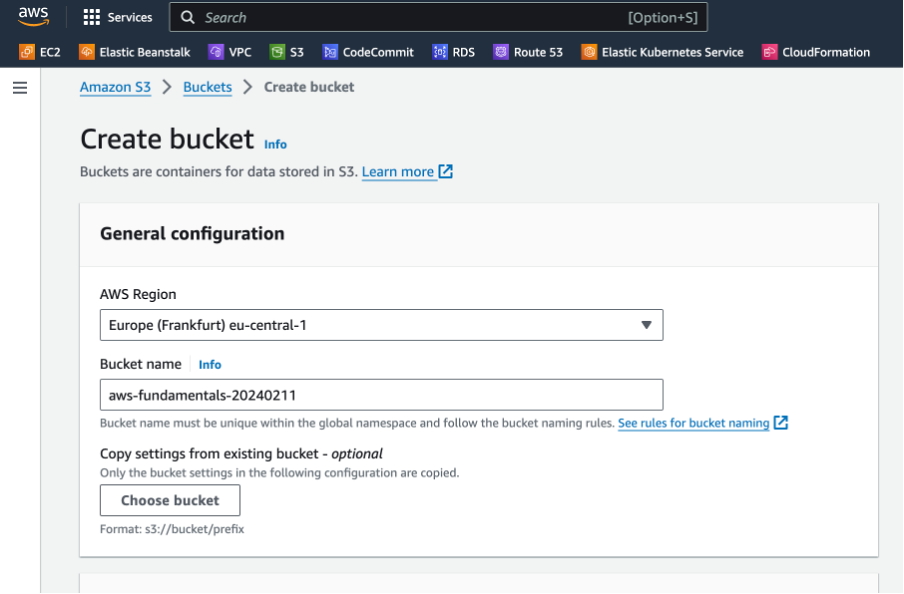
- **Bucket Configuration**: 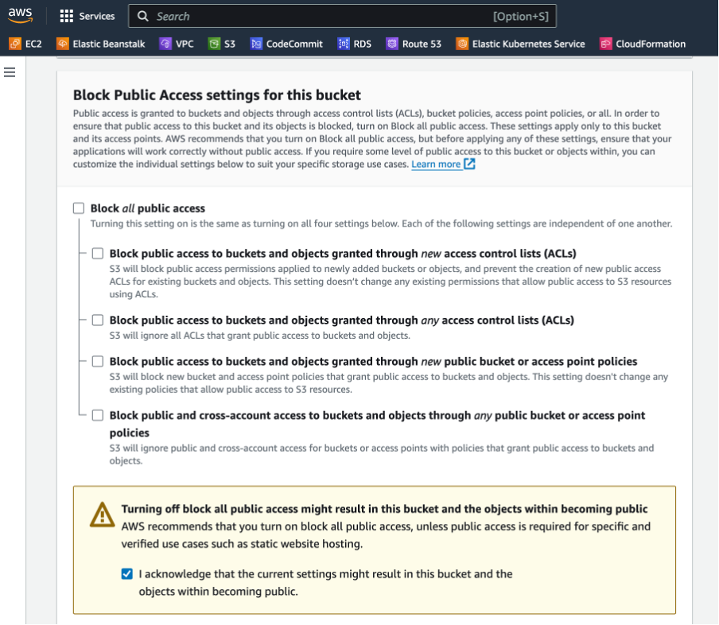

## Step 2: Enable Website Hosting on S3

Navigate to the bucket's properties tab, select Static Website Hosting, and enable "Host a static website". The index document is set to `index.html`.

- **Static Website Hosting Configuration**: 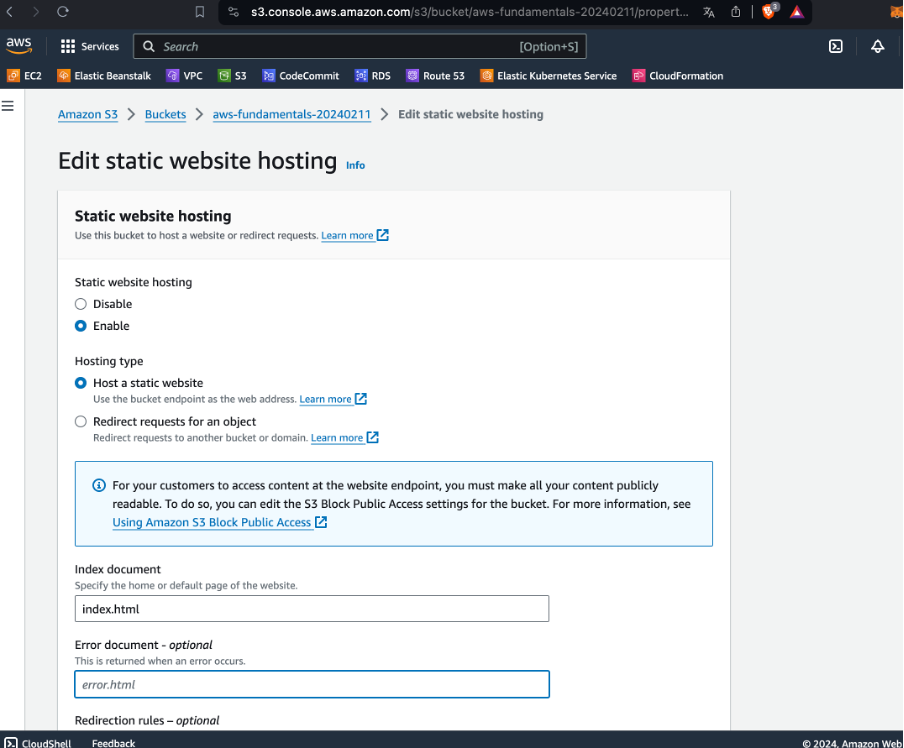

## Step 3: Set Bucket Policy

Setting a bucket policy is crucial for defining access permissions. We allow public read access to the objects stored within the bucket, enabling users to view the website.

- **Bucket Policy**: 
```json
{
    "Version": "2012-10-17",
    "Statement": [
        {
            "Effect": "Allow",
            "Principal": "*",
            "Action": "s3:GetObject",
            "Resource": "arn:aws:s3:::aws-fundamentals-20240211/*"
        }
    ]
}
```
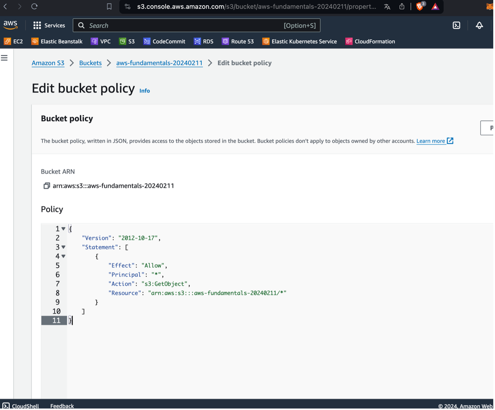

## Step 4: Upload Website Content and Access Website

Upload a simple `index.html` file to your bucket and obtain the link to your website from the Static Website Hosting section.

- **Upload and Website Link**: 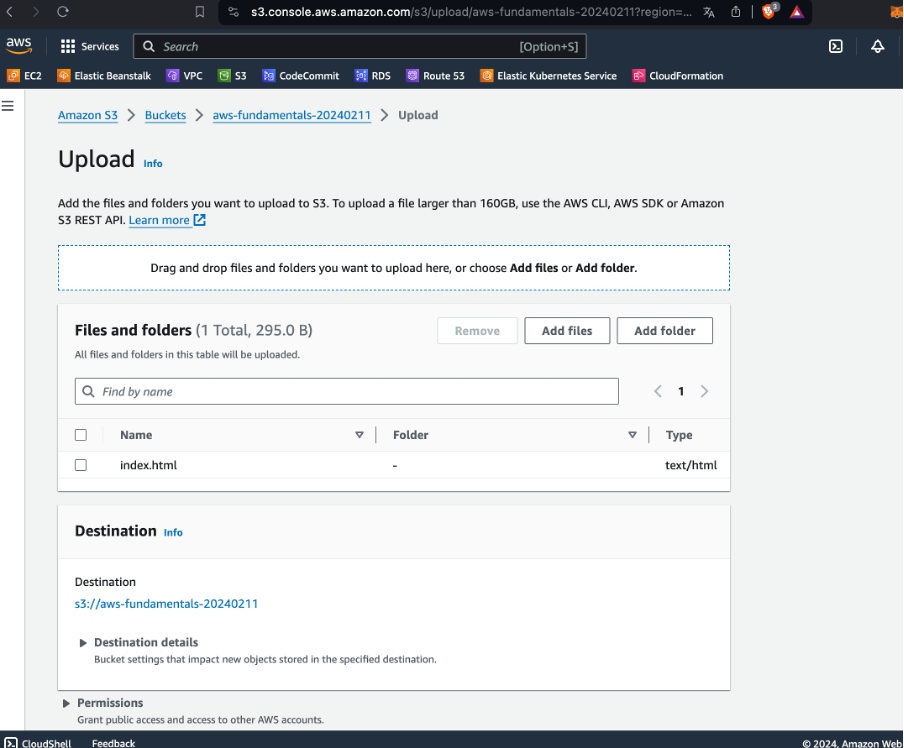
- **Website Preview**: 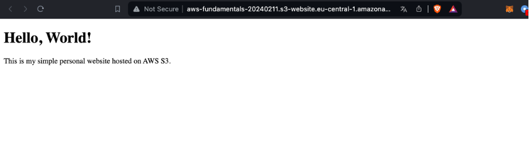

## Step 5: GitHub Repository and Workflow Setup

Create a repository on GitHub and store the `index.html` file in the `./main` directory. The GitHub workflow in `.github/workflows/main.yml` automates deployment to S3 upon changes to the main branch.

- **Workflow File Content**:
```yaml
name: Deploy Static Website to S3

on:
  push:
    branches:
    - main

jobs:
  deploy-site:
    runs-on: ubuntu-latest
    steps:
      - uses: actions/checkout@v2
      - uses: jakejarvis/s3-sync-action@master
        with:
          args: --delete
        env:
          AWS_S3_BUCKET: aws-fundamentals-20240211
          AWS_ACCESS_KEY_ID: ${{ secrets.AWS_ACCESS_KEY_ID }}
          AWS_SECRET_ACCESS_KEY: ${{ secrets.AWS_SECRET_ACCESS_KEY }}
          SOURCE_DIR: ./main
```


## Step 6: IAM User Creation and GitHub Secrets Configuration

Create an IAM user with programmatic access and `AmazonS3FullAccess` permission. Use the generated access key and secret for GitHub repository secrets to allow GitHub Actions to deploy the website.

- **IAM User Creation and Permissions**: 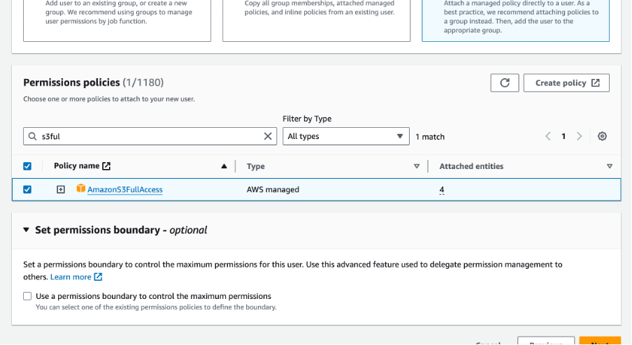
- **Access Key Creation**: 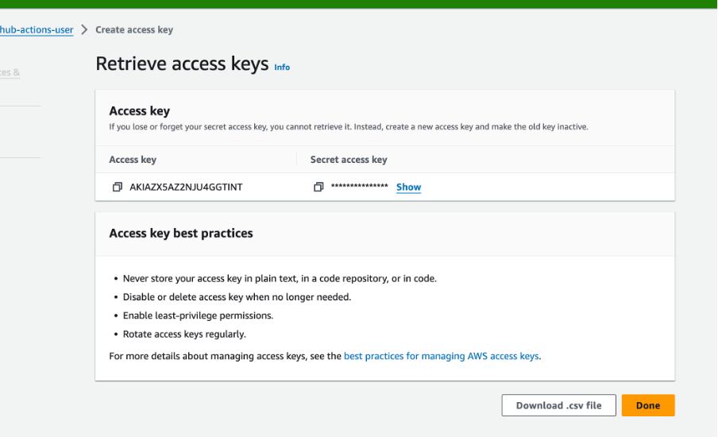
- **Adding Credentials to GitHub Secrets**: 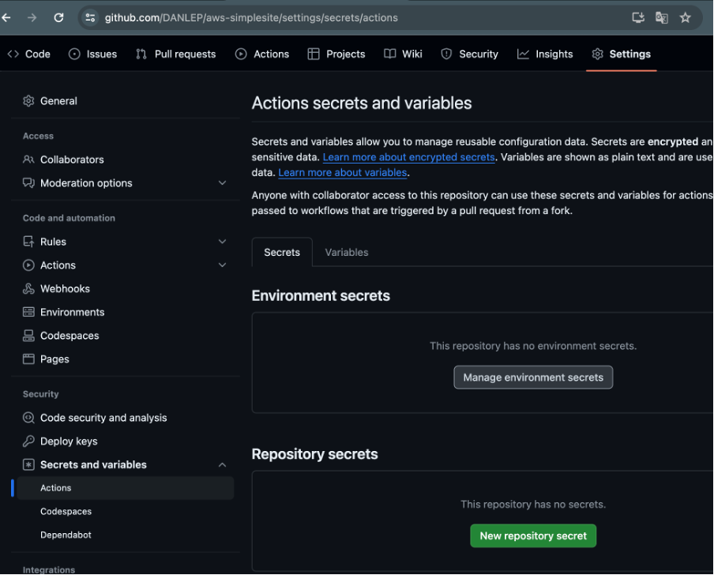

## Step 7: Verifying GitHub Actions Deployment

Upon committing changes, the GitHub Actions workflow triggers and deploys the changes to the S3 bucket.

- **GitHub Actions Success**: 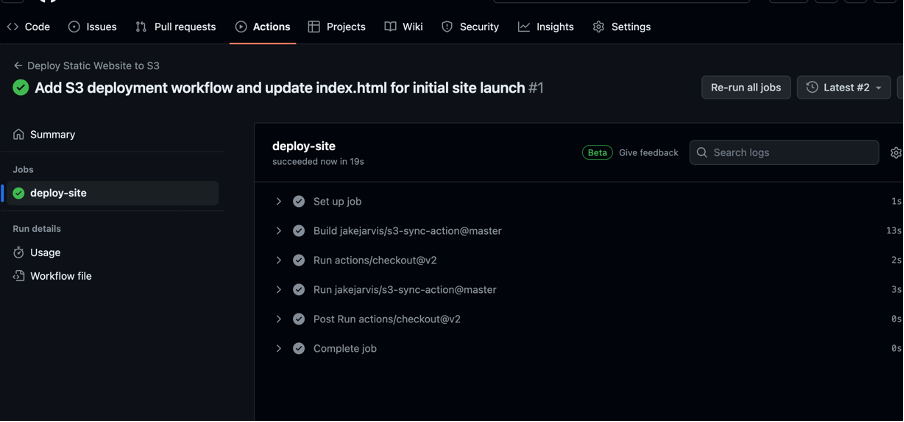

## Step 8: Branching and Merging for Updates

Create a `main-test` branch for testing changes, commit modifications, and merge back to the main branch to trigger deployment.

- **Pull Request and Merge**: 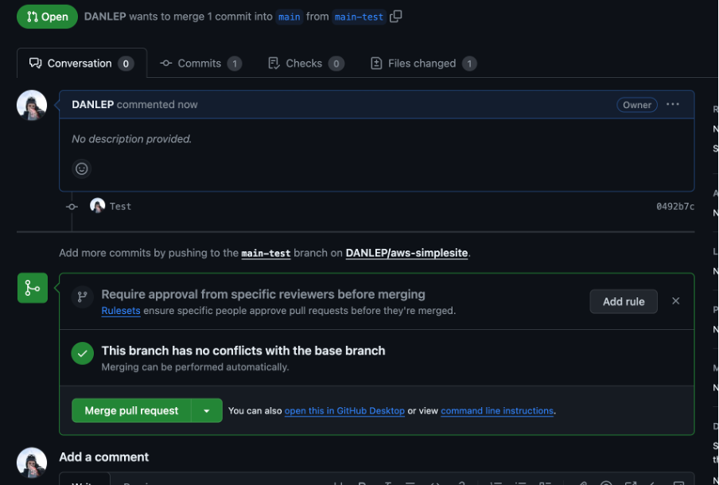
- **Updated Website**: 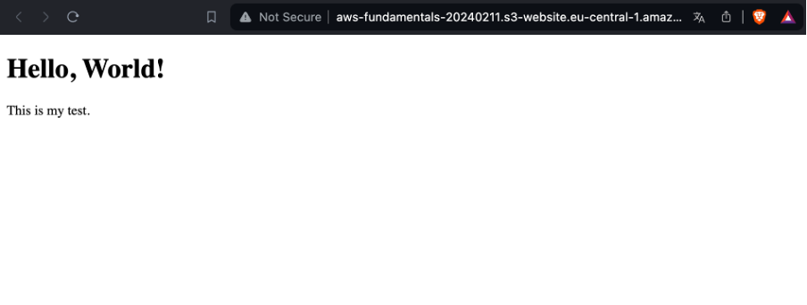
